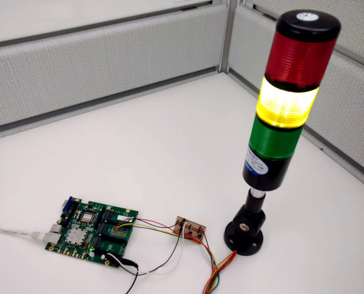

TrafficLight Legato App
=======================

Description
-----------

TrafficLight App is primarily used to monitor the status of a last completed Jenkins build.
It can also be used to monitor [sensu](http://sensu.io/) or any other REST API.

It polls a settable URL at a settable interval that can be displayed on the device config tree or
`LE_INFO` logs.
The user can toggle `exitCodeCheck` and `contentCodeCheck` in the config tree to individually
check the results of the HTTP Code, content result, or both (See States below).

This was developed using:
* [Legato](https://legato.io) IoT Framework
* [Sierra Wireless WP85xx](https://www.sierrawireless.com/products-and-solutions/embedded-solutions/products/wp8548/) - Release 14
* [MangOH Green](http://mangoh.io/mangoh-green-resources) + [IoT expansion card (for GPIO)](http://mangoh.io/iot-card-resources)
* [Tower Light 3 colors - 12VDC](https://www.adafruit.com/product/2993)
* 3x 2N3904 transistor
* 3x 1K Ohm resistor
* 3x 100 Ohm resistor

Min versions:
* Legato 18.05.0
* WP85xx Release 15

Schematic Diagram
-----------------

How to deploy it?
-----------------

Read instructions on [DEPLOY.md](DEPLOY.md).

States
------

`exitCodeCheck` | `contentCodeCheck` | HTTP Code   | Light Output
:---------------|--------------------|-------------|:---------------
 `true`         | `true`             | `200`       | `contentState`
 `true`         | `true`             | `!200`      | `LIGHT_RED`
 `true`         | `false`            | `200`       | `LIGHT_GREEN`
 `true`         | `false`            | `!200`      | `LIGHT_RED`
 `false`        | `true`             | `N/A`       | `contentState`
 `false`        | `false`            | `N/A`       | `LIGHT_GREEN`

`contentState`
--------------

2 modes are supported at the moment:
- `jenkins`
  To monitor the status of a Jenkins build.
- `sensu`
  To monitor the health of a system.

 Light Output   | Status
:---------------|:---------------------------
 `LIGHT_GREEN`  | `SUCCESS`
 `LIGHT_YELLOW` | `ABORTED`
 "              | `UNSTABLE`
 `LIGHT_RED`    | `FAILURE`
 "              | `NULL` (cannot find keyword)
